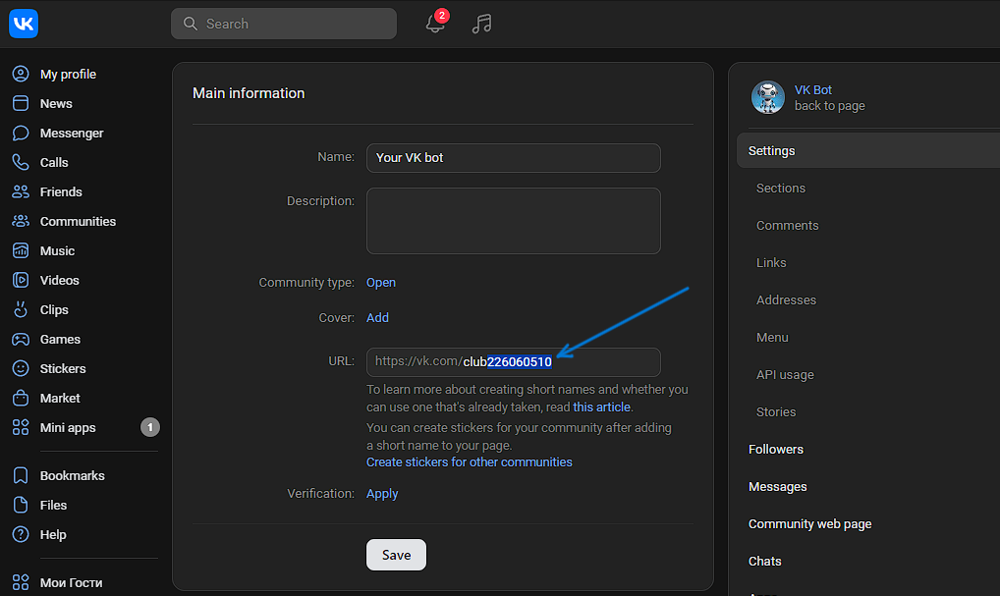
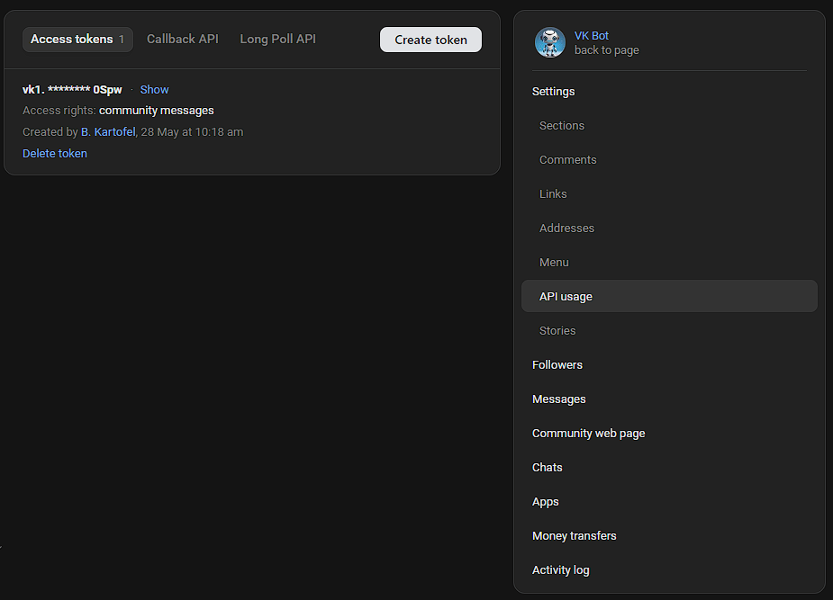

## Запуск бота

1. Задаём параметры бота (ID группы и Ваш токен бота).

В папке `./src/main/resources/application.properties` изменяем ключи `bot.group-id` и `bot.access-token`:

Вместо `${GROUP_ID}` вписываем Ваш ID группы. Посмотреть его можно в настройках Вашего бота, как на картинке



Аналогично, вместо `${TOKEN}` вписываем Ваш токен бота. Для начала, нужно его создать во вкладке Настройки -> Использование API. Пример на картинке:




2. Переходим в директорию бота и выполняем следующую команду:
```mvn spring-boot:run```